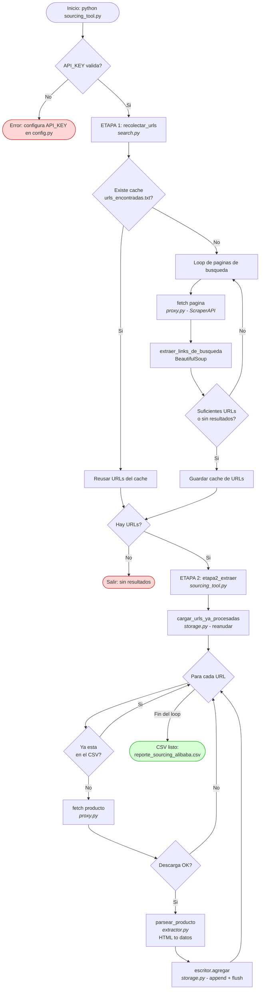
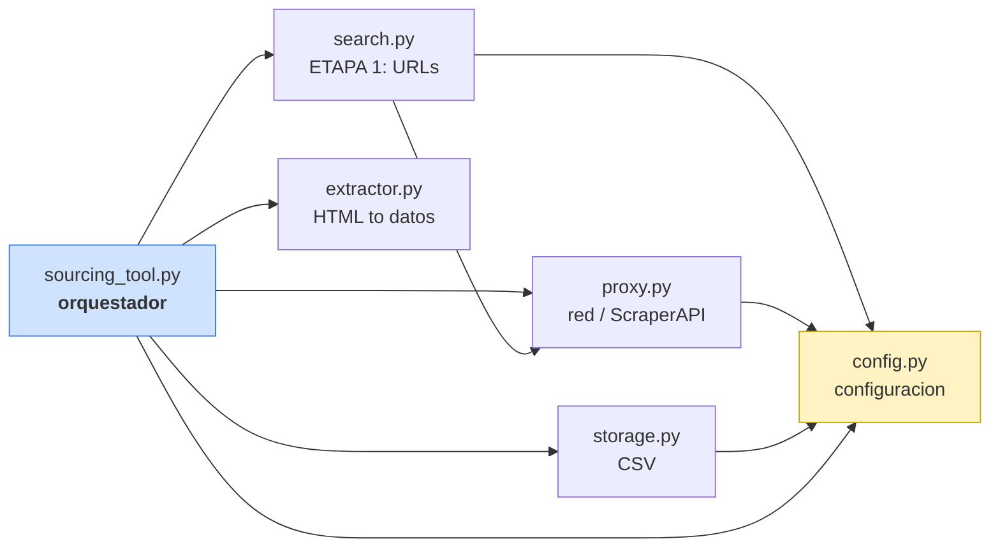

# Diagrama de flujo — Sourcing Tool (arquitectura modular SRP)

## 1) Flujo de ejecución (qué pasa al correr `python sourcing_tool.py`)

## 2) Dependencias entre modulos (quien usa a quien)

> Nota: `extractor.py` NO depende de nada propio (solo de BeautifulSoup).
> Por eso es el modulo mas facil de probar de forma aislada.
