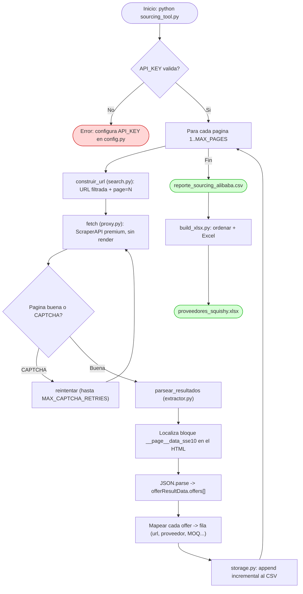
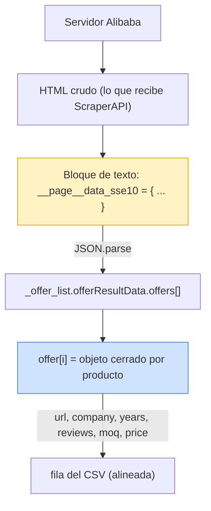
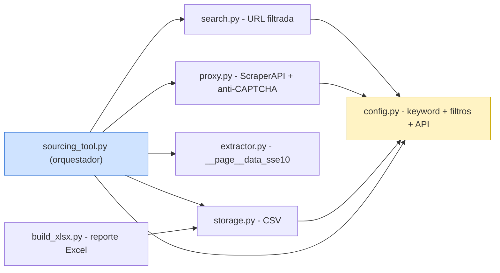

# Diagrama de flujo — Sourcing Tool (ScraperAPI + `__page__data_sse10`)

## 1) Flujo de ejecución

## 2) De dónde salen los datos (capas de la página)

> El objeto viene **incrustado como texto** en el HTML, así que ScraperAPI lo
> obtiene **sin renderizar JavaScript**. Cada `offer` es un objeto completo →
> alineación exacta (no se cruzan URL / proveedor / métricas).

## 3) Dependencias entre módulos

