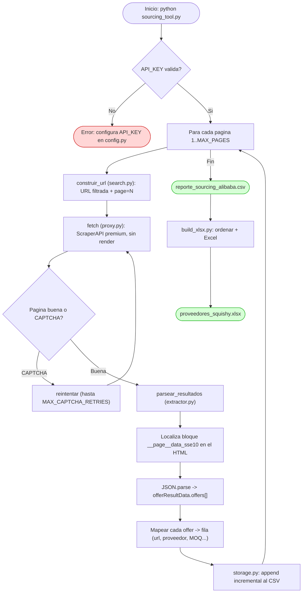
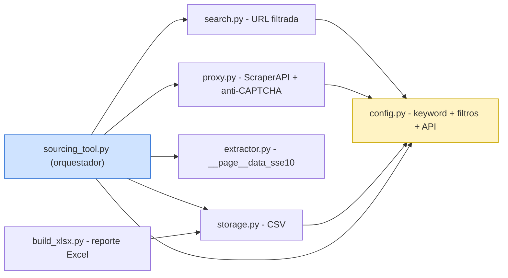

# Alibaba Sourcing Tool

Herramienta de sourcing que extrae proveedores de **Alibaba.com** a través de
**ScraperAPI** (proxy con IPs rotativas que resuelve bloqueos) y exporta un
reporte Excel con datos ya filtrados y **alineados por producto**.

Pensada para comprador de e-commerce / Amazon FBA: aplica los filtros de calidad
**en la propia URL de Alibaba** (Verified Supplier + Trade Assurance + certificación
CPC + rating), así cada página trae candidatos pre-cualificados.

## La clave técnica: de dónde salen los datos

Alibaba **incrusta en el HTML** un objeto JavaScript (`__page__data_sse10`) con la
lista completa de productos ya estructurada. En vez de raspar el HTML visible
(frágil y desalineado), leemos ese objeto:

```
window.__page__data_sse10 -> _offer_list -> offerResultData -> offers[]
```

Cada `offer` es un objeto cerrado con todos sus campos (URL, proveedor, años,
rating, reviews, MOQ, precio…), por lo que **la alineación es exacta**. Como el
objeto viene como texto en el HTML, ScraperAPI lo obtiene **sin renderizar JS**.

## Módulos (arquitectura modular / SRP)

| Archivo | Responsabilidad |
|---|---|
| `config.py` | Configuración: keyword, filtros, ajustes ScraperAPI. *(No se sube: tiene la API Key. Ver `config.example.py`)* |
| `search.py` | Construye la URL filtrada de la interfaz clásica + paginación. |
| `proxy.py` | Descarga vía ScraperAPI con reintentos anti-CAPTCHA. |
| `extractor.py` | Parsea el objeto `__page__data_sse10` → lista de productos. |
| `storage.py` | Persistencia CSV incremental (reanudable). |
| `sourcing_tool.py` | Punto de entrada: orquesta todo. |
| `build_xlsx.py` | Genera el reporte Excel ordenado. |

## Instalación

```bash
pip install requests beautifulsoup4 pandas openpyxl
```

## Uso

1. Copia `config.example.py` a `config.py` y pon tu `API_KEY` de ScraperAPI.
2. Ajusta `KEYWORD`, `FILTROS` y `MAX_PAGES`.
3. Ejecuta:

```bash
python sourcing_tool.py      # extrae -> reporte_sourcing_alibaba.csv
python build_xlsx.py         # genera -> proveedores_squishy.xlsx
```

Columnas del reporte: `URL · Producto · Proveedor · País · Años · Rating ·
Reviews · Service · Shipping · Precio · MOQ`, ordenadas por
**# reviews → años verificado → service score → precio mínimo**.

---

## Diagrama de flujo (ejecución)



## Dependencias entre módulos



## Notas

- **Filtros en la URL** (interfaz clásica `/trade/search`): `assessmentCompany=true`
  (Verified), `ta=y` (Trade Assurance), `productAuthTag=CPC`, `reviewScore=4`,
  `sortType=prodSold180` (más vendidos).
- **Sin `pageSize`**: se deja el default (~48/pág) para que la paginación no
  se salte productos (el SSR sólo "hornea" ~63 aunque pidas 100).
- **Créditos**: Alibaba es dominio protegido → requiere `premium`. El plan gratis
  **no** permite `ultra_premium`. Cada página buena ≈ 1 petición premium (+ los
  reintentos si aparece CAPTCHA).
- **Datos de la ficha** (fábrica vs trader, OEM, lead time, response rate) no están
  en resultados; requieren abrir cada producto. Úsalo sólo para tus finalistas.
