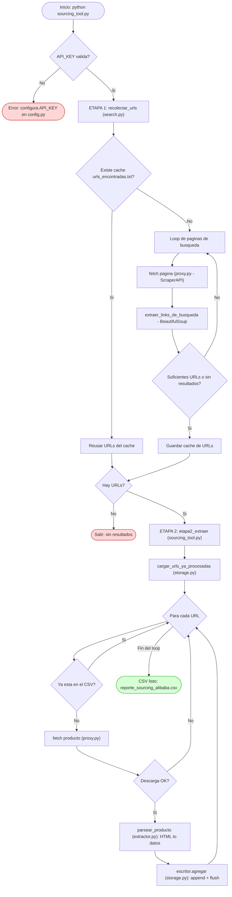
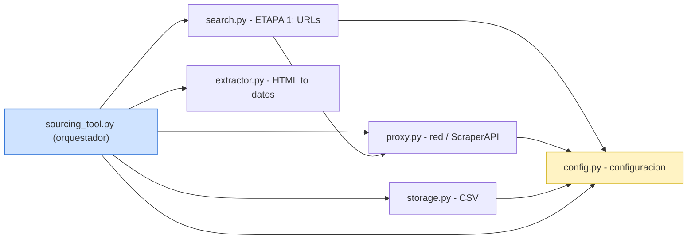

# Alibaba Sourcing Tool

Herramienta de sourcing que busca productos en **Alibaba.com** a través de
**ScraperAPI** (proxy que resuelve bloqueos y CAPTCHAs en la nube) y exporta
un reporte CSV con **título, proveedor, MOQ y precio**.

Diseño **modular (SRP)**: cada archivo tiene una única responsabilidad y la
escritura del CSV es incremental (bajo uso de RAM y se puede reanudar).

## Módulos

| Archivo | Responsabilidad |
|---|---|
| `config.py` | Configuración central (API key, keyword, opciones). |
| `proxy.py` | Descargas vía ScraperAPI (red). |
| `search.py` | ETAPA 1: recolectar URLs de productos. |
| `extractor.py` | Transformar HTML → datos del producto. |
| `storage.py` | Persistencia en CSV. |
| `sourcing_tool.py` | Punto de entrada: orquesta todo. |

## Instalación

```bash
pip install requests beautifulsoup4 pandas
```

## Uso

1. Edita `config.py`: pon tu `API_KEY` de ScraperAPI y tu `KEYWORD`.
2. Ejecuta:

```bash
python sourcing_tool.py
```

3. Se genera `reporte_sourcing_alibaba.csv` (abrible en Excel).

> Empieza con `MAX_PRODUCTS = 20` para validar antes de lanzar los 1000.

---

## Diagrama de flujo (ejecución)



## Dependencias entre módulos



## Aviso sobre créditos

Alibaba requiere `render=true` (JS), por lo que cada producto puede costar
~10 créditos en ScraperAPI. 1000 productos ≈ 10 000 créditos (más que el plan
gratuito de 5000). Haz pruebas pequeñas y revisa el consumo en tu panel.
